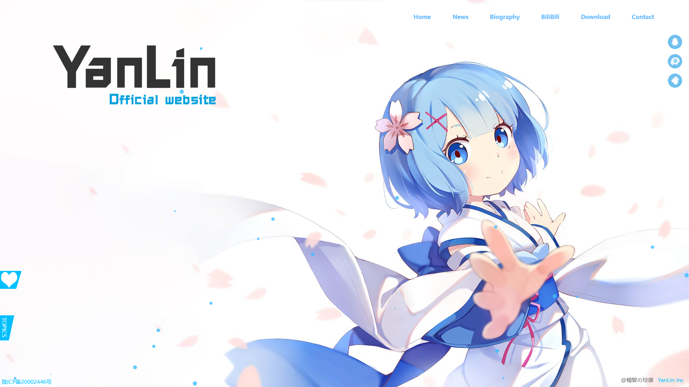
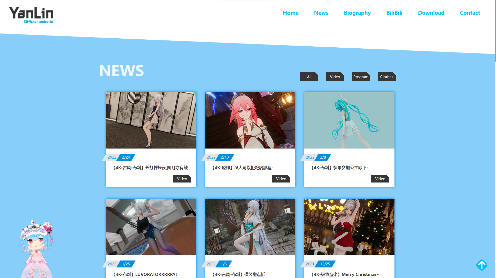
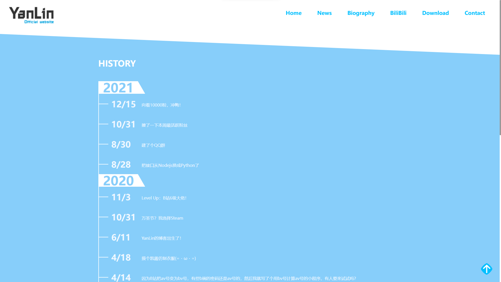
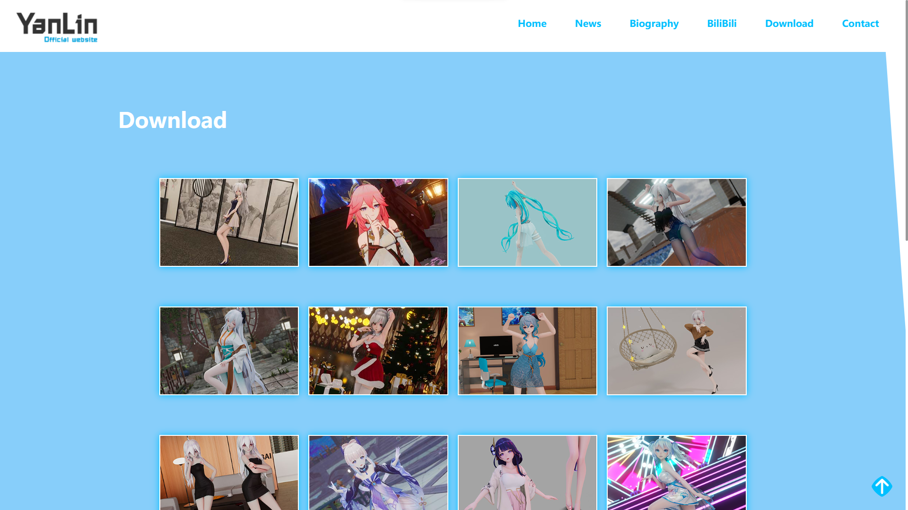
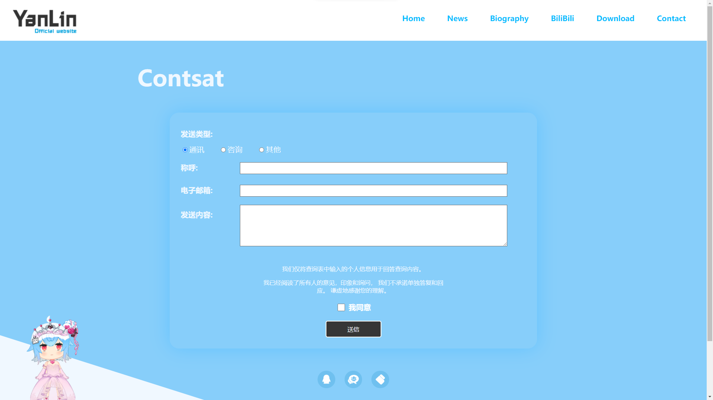
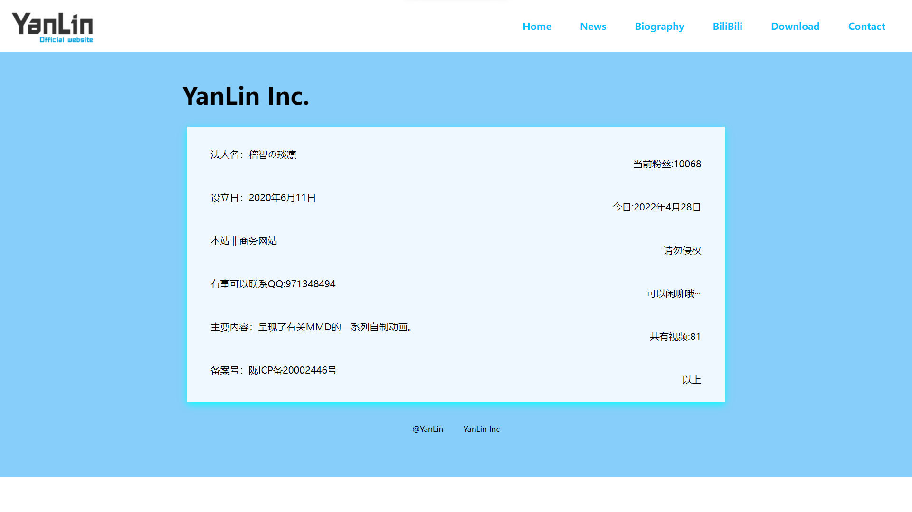

# YanLin-Blog

> Vue.js+Python+Mysql的前后端分离的个人博客

## 主要技术构成
前端主要技术栈为Vue.js,Axios,Jquery等···

后端主要技术栈为Python,Mysql等···

## 目录
* [YanLin-Blog](#YanLin-Blog)
* [主要技术构成](#主要技术构成)
* [目录](#目录)
* [博客功能](#博客功能)
    * [前台页面](#前台页面)
    * [后端API](#后端API)
    * [效果展示](#效果展示)
    * [文件目录](#文件目录)
    * [TODO](#TODO)
* [License](#License)

## 博客功能
### 前台页面
- Home                 主页
- News                 新闻页
- Biography            博客时间线
- Download             视频下载页
- Contsat              收集表单页
- About                关于我
- 404                  错误页面
### 后端API
- index                发送接收页
### 效果展示
主页


新闻页


时间线


下载页


收集表单


关于


### 文件目录
```
├─README.md 
│ .gitignore 
│
├─API
│  │
│  ├─index.py       主要Flask模块
│  ├─LinkData.py    连接数据库模块
│  ├─SendEmail.py   发送邮件模块
│  ├─Get_music.py   获取音乐模块
│  └─Process.py     处理Json信息模块
│
├─Web
│  │
│  ├─index.html     主页
│  ├─404.html       错误页
│  ├─css            样式表文件夹
│  ├─html           子页面文件夹
│  ├─img            静态图片文件夹
│  ├─js             JS应用文件夹
│  └─live2d         Live2D应用
│
└─End
```

### TODO
- 简化webpack配置
- 添加代码规范。BEM + JsDoc
- 重构代码

## License

[Yan_Lin](https://github.com/1730933627/Blog/blob/main/README.md)